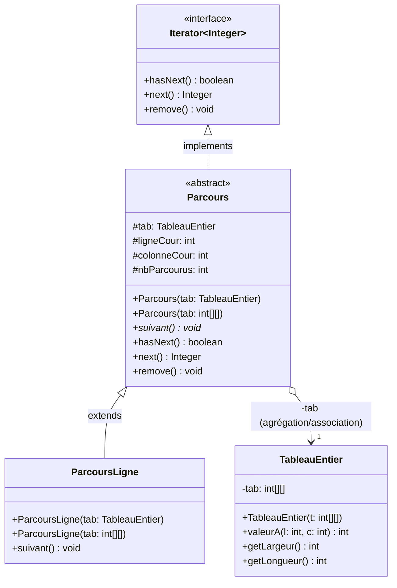

# Diagramme de classes du projet

## Description des classes et relations

- **`Iterator<Integer>`** : Interface standard Java pour l'itération (`hasNext()`, `next()`, `remove()`).
- **`TableauEntier`** : Encapsule un tableau 2D d'entiers avec ses accesseurs.
- **`Parcours`** : Classe abstraite implémentant `Iterator<Integer>`, conservant les indices et le compteur d'éléments parcourus, et déléguant le saut à la méthode abstraite `suivant()`.
- **`ParcoursLigne`** : Classe concrète étendant `Parcours` qui implémente le parcours ligne par ligne.
